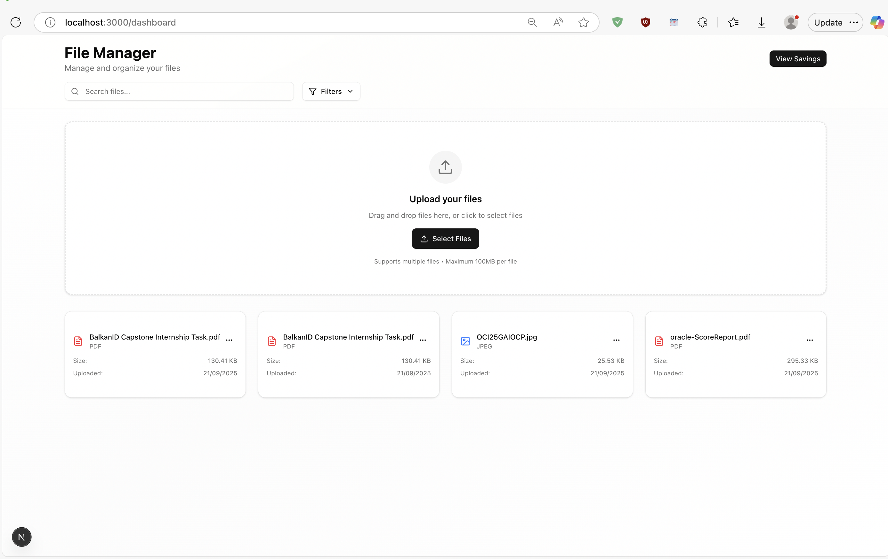
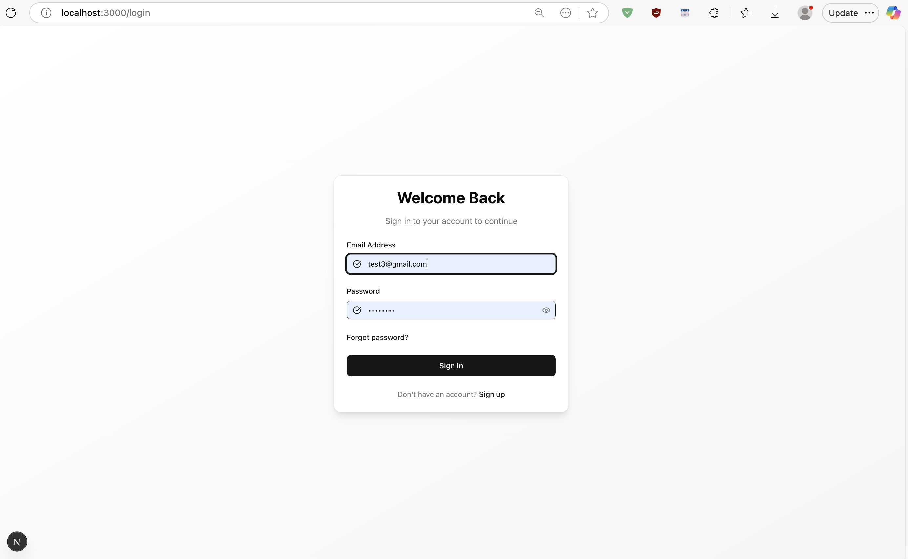
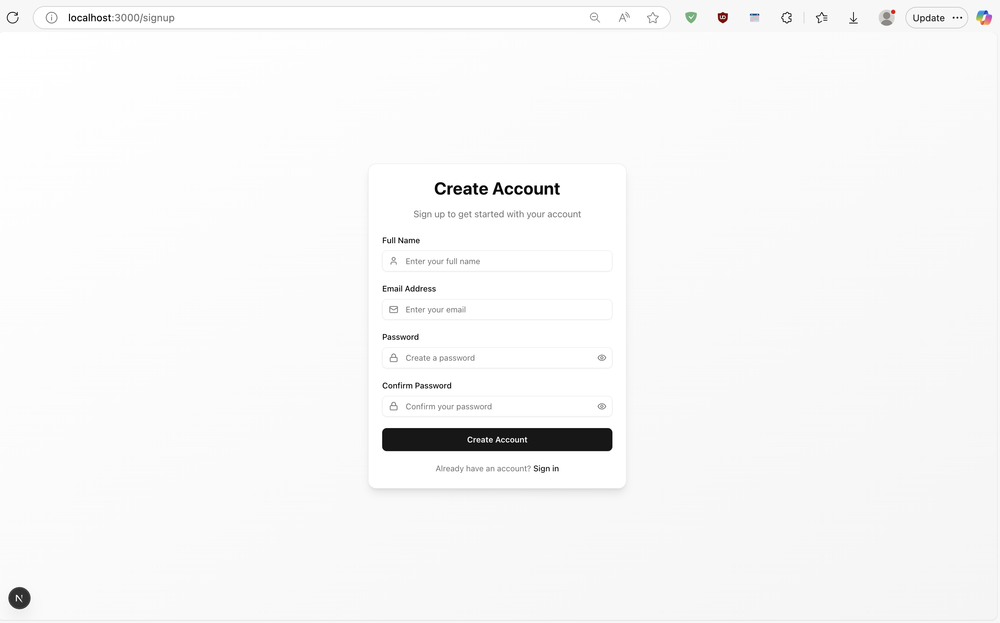
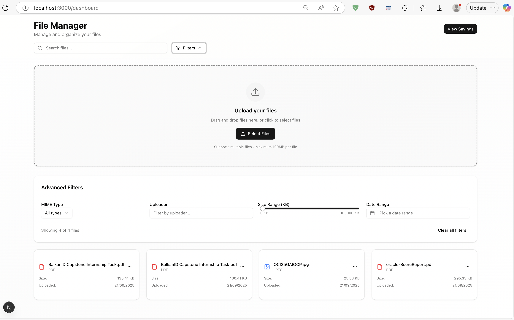
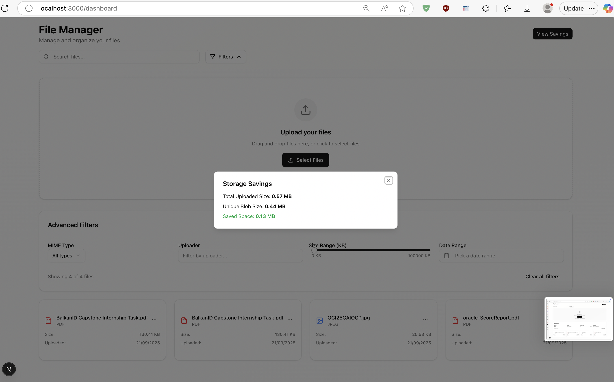

# Vaultify Frontend

A modern Next.js (React) frontend for the BalkanID Auth system, providing user authentication, file upload, and admin dashboard interfaces.

---

## Features
- User registration & login (JWT-based)
- File upload and download UI
- Admin dashboard
- Responsive, accessible design (Radix UI, Tailwind CSS)

---

## Project Structure
- `src/app/` – App routes (login, signup, dashboard, admin)
- `src/components/` – UI components
- `public/` – Static assets
- `docs/` – [Documentation](docs/)
    - [UI Images](docs/images/)
    - [Demo Recording](docs/recording/)

---

## Getting Started

1. **Install dependencies:**
   ```bash
   npm install
   # or
   yarn install
   ```
2. **Run the development server:**
   ```bash
   npm run dev
   ```
   Open [http://localhost:3000](http://localhost:3000) in your browser.


---

## Documentation & Resources
- [API Spec (OpenAPI)] (docs/api-spec.yaml)
- [System Design](docs/design.md)
- [UI Images](docs/images/)
- [Demo Recording](docs/recording/bid_recording.mov)

---

## Screenshots

| Home Page | Admin Page | Login | Signup |
|-----------|------------|-------|--------|
|  |  |  |  |

| Filters | Preview | Savings Per User |
|---------|---------|------------------|
|  |  |  |

---

## Demo Recording

- [Watch Demo (mov)](../docs/recording/bid_recording.mov)

---

## License
MIT
